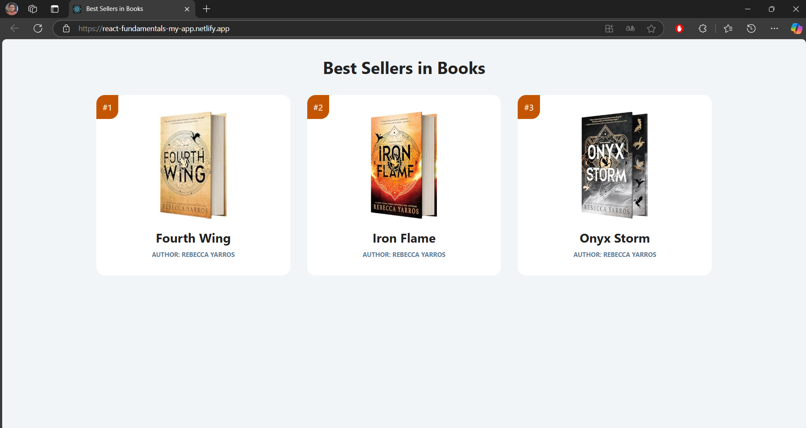

# Best Sellirs in Books

"Best Sellirs in Books" é meu primeiro projeto em React, criado para praticar conceitos fundamentais. A ideia foi desenvolver uma página simples que exibe os três livros mais vendidos, com cada card de livro sendo sendo feito por um único **componente**, tornando possível adicionar quantos card quiser bem fácil.

## Imagem do Projeto



## Link do Projeto

Best Sellirs in Books: [https://react-fundamentals-my-app.netlify.app/](https://react-fundamentals-my-app.netlify.app/)

## Tecnologias Utilizadas

- **React**: Para criar os componentes.
- **CSS**: Para estilização.

## Como Rodar o Projeto

1. Clone o repositório:
   ```bash
    git clone https://github.com/seu-usuario/best-sellirs-in-books.git
2. Navegue até a pasta do projeto:
    ```bash
    cd best-sellirs-in-books
3. Instale as dependências:
    ```bash
    npm install
4. Inicie o servidor de desenvolvimento:
    ```bash
    npm start

## Contato

Conecte-se comigo no [LinkedIn](https://www.linkedin.com/in/danilo-almeida-milhome/).